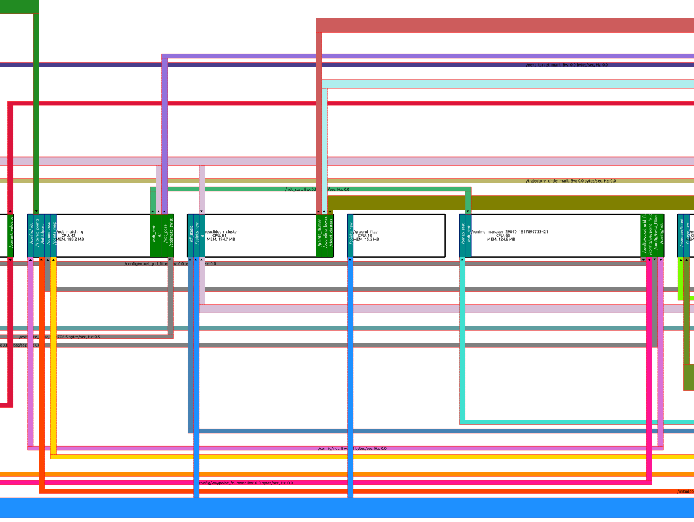
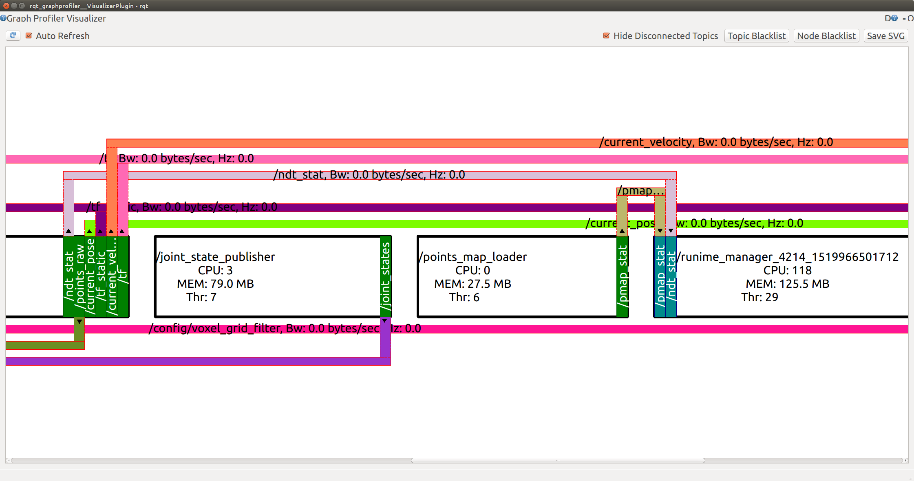
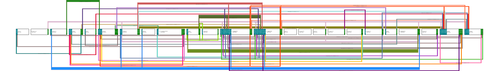

# rqt_graphprofiler

A ROS System Profiling and Visualization tool

## Introduction
`rqt_graphprofiler` is a ROS profiling and visualization tool. This project was started by Dan Brooks (@mrdanbrooks) at @osrf/rqt_graphprofiler.
The initial proposal for this tool is detailed in: [ROS System Profiling and Visualization](http://nerve.uml.edu/ros-2014/ROS%20System%20Profiling%20and%20Visualization%20-%20Dan%20Brooks.pdf)

Different from `rqt_graph`, which produces a rather simple display of nodes and their connections using dot, `rqt_graphprofiler` renders more intuitive graphs of nodes, published/subscribed topics, bandwidths, CPU and memory usage, etc. 

<div align="center"></div>

## Running it
`rqt_graphprofiler` needs the `rosprofiler` package to get the statistics data.

### Running `rosprofiler`
`rosprofiler` needs the `/enable_statistics` parameter:
```
rosparam set enable_statistics true
```

Now run `rosprofiler` and `rosgrapher` on different terminals:
```
rosrun rosprofiler rosprofiler
rosrun rosprofiler rosgrapher
```

### Running `rqt_graphprofiler`
```
rosrun rqt_graphprofiler rqt_graphprofiler
```

<div align="center"></div>

It allows to blacklist topics and nodes we don't need to see and also output SVG images.
<div align="center"></div>

## Issues
`rqt_graphprofiler` has been without activity since 18 Oct. 2014, the latest release is 0.1.2.
Many of the PyQt functions it uses have gone deprecated and doesn't work in newer releases of ROS.
An effort was made to overcome such limitations and release 0.1.3 was proposed.

## Todo
- [x] Support for PyQt5 and ROS Kinetic
- [x] Fix mouse zoom/drag issues
- [x] Added more information in nodes and bands
- [x] Added variable width of nodes and horizontal text layout
- [ ] Evaluate nodes and machine location
- [ ] Fix incorrect alignments of nodes' text
- [ ] Add curved bands as shown in the original document
- [ ] Improve bands sorting and widths
- [ ] Fix spurious crashes
- [x] Support SVG output
- [ ] \(optional) Support PNG output
- [ ] \(optional) Support PDF output

